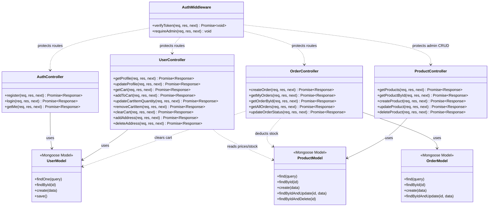
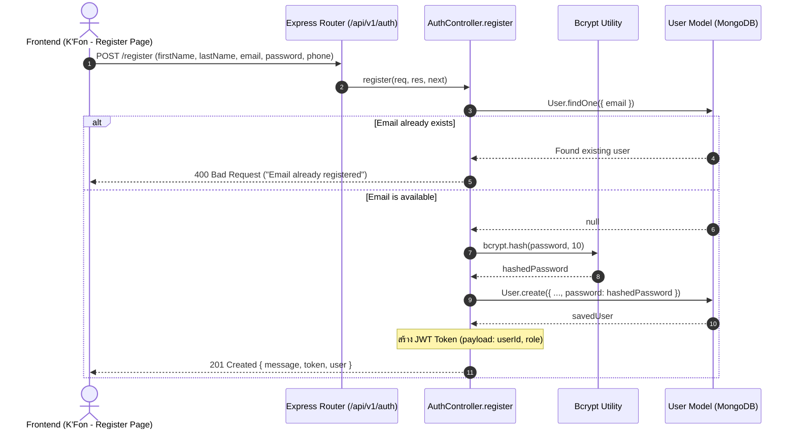
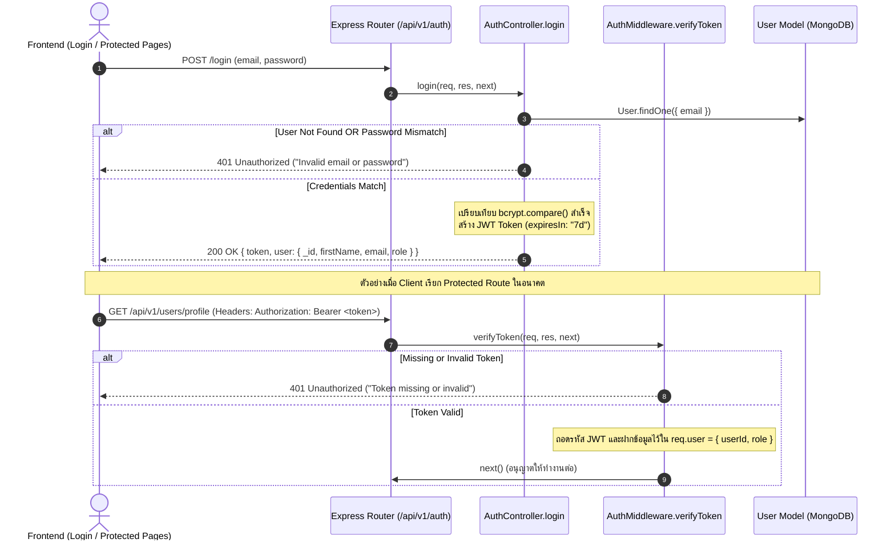
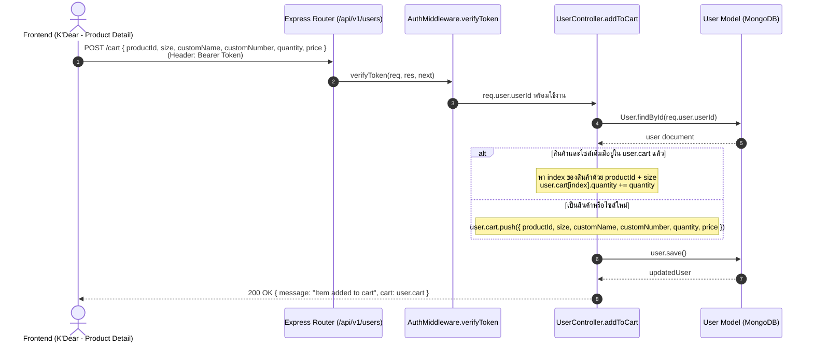
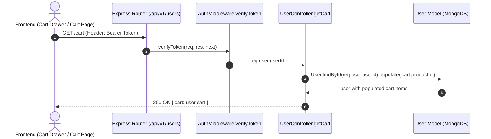
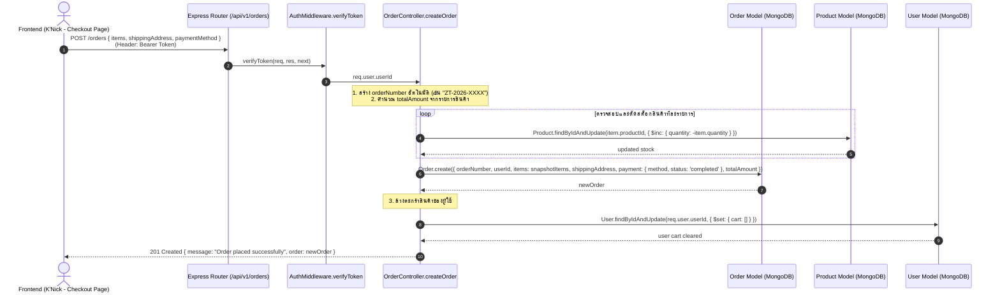
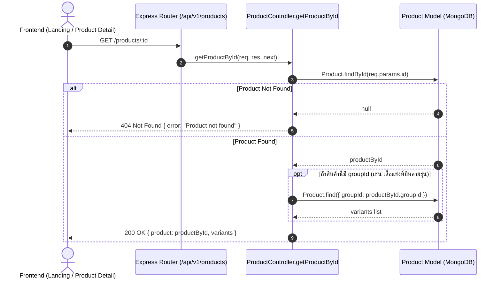
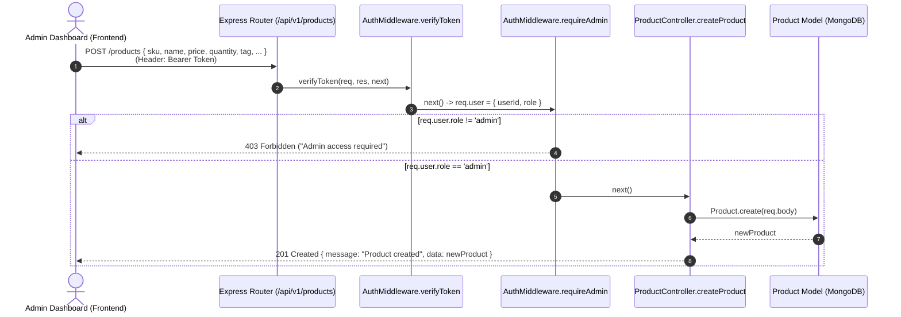

# 🛠️ Backend Controllers Architecture & UML Specification
**Project:** Zeta (ζ) - Football Jersey E-Commerce Store  
**Stack:** Node.js, Express 5, MongoDB, Mongoose ODM, JWT, Bcrypt  
**Target:** JSD13 Group Project (Sprint 2 & Sprint 3)  
**Purpose:** เอกสารออกแบบระบบและไดอะแกรม UML สำหรับ Backend Controllers ทั้งหมด (Auth, User/Cart, Order, Product) เพื่อให้สมาชิกในทีมทุกคนที่เป็นมือใหม่สามารถเข้าใจภาพรวม Data Flow และการทำงานร่วมกันได้อย่างชัดเจน

---

## 📌 สารบัญ (Table of Contents)
1. [ภาพรวมสถาปัตยกรรม Backend (System Architecture)](#1-ภาพรวมสถาปัตยกรรม-backend-system-architecture)
2. [UML Class Diagram: Controllers & Middlewares](#2-uml-class-diagram-controllers--middlewares)
3. [UML Sequence Diagram 1: ระบบสมาชิกและความปลอดภัย (Auth Controller & Middleware)](#3-uml-sequence-diagram-1-ระบบสมาชิกและความปลอดภัย-auth-controller--middleware)
4. [UML Sequence Diagram 2: ระบบจัดการโปรไฟล์และตะกร้าสินค้า (User Controller)](#4-uml-sequence-diagram-2-ระบบจัดการโปรไฟล์และตะกร้าสินค้า-user-controller)
5. [UML Sequence Diagram 3: ระบบสั่งซื้อและเช็คเอาต์ (Order Controller - Checkout Flow)](#5-uml-sequence-diagram-3-ระบบสั่งซื้อและเช็คเอาต์-order-controller---checkout-flow)
6. [UML Sequence Diagram 4: ระบบค้นหาสินค้าและจัดการคลัง (Product Controller)](#6-uml-sequence-diagram-4-ระบบค้นหาสินค้าและจัดการคลัง-product-controller)
7. [API Endpoint Matrix (ตารางสรุป Route และ Controller)](#7-api-endpoint-matrix-ตารางสรุป-route-และ-controller)

---

## 1. ภาพรวมสถาปัตยกรรม Backend (System Architecture)

ระบบ Backend ของ Zeta ออกแบบตามรูปแบบ **Layered Architecture (MVC - Controller Layer)**:
1. **Routing Layer (`src/routes`)**: รับ HTTP Request จาก Client และแจกจ่ายไปยัง Endpoint ที่ถูกต้อง
2. **Middleware Layer (`src/middlewares`)**: ตรวจสอบความถูกต้องและสิทธิ์การใช้งาน (เช่น ตรวจสอบ JWT Token หรือตรวจ Role Admin)
3. **Controller Layer (`src/controllers`)**: จัดการ Business Logic, ตรวจสอบ Payload, เรียกใช้งาน Mongoose Model, และตอบกลับด้วย JSON Response หรือส่งต่อไปยัง Error Handler
4. **Model Layer (`src/models`)**: กำหนด Schema, Data Validation, และสื่อสารกับ MongoDB Atlas

```mermaid
graph LR
    subgraph Frontend ["Frontend (React App)"]
        UI["React Components / Pages"]
    end

    subgraph ExpressServer ["Express Server"]
        Router["Express Router (/api/v1)"]
        MW["Auth Middleware (verifyToken / checkAdmin)"]
        
        subgraph Controllers ["Controllers Layer"]
            AC["AuthController"]
            UC["UserController (Profile & Cart)"]
            OC["OrderController"]
            PC["ProductController"]
        end
        
        ErrorHandler["Global Error Handler (500)"]
    end

    subgraph Database ["Mongoose / MongoDB"]
        UM[("User Collection")]
        PM[("Product Collection")]
        OM[("Order Collection")]
    end

    UI -->|HTTP Request| Router
    Router --> MW
    MW -->|Authorized| Controllers
    MW -.->|Invalid Token 401| UI
    
    AC --> UM
    UC --> UM
    UC --> PM
    OC --> OM
    OC --> PM
    OC --> UM
    PC --> PM
    
    Controllers -->|Success 200/201| UI
    Controllers -.->|Error next(err)| ErrorHandler
    ErrorHandler -.->|500 JSON Response| UI
```

---

## 2. UML Class Diagram: Controllers & Middlewares

แผนภาพคลาสแสดงฟังก์ชัน (Methods) ในแต่ละ Controller, พารามิเตอร์ที่รับ (`req`, `res`, `next`), และความสัมพันธ์กับ Model ที่เกี่ยวข้อง



---

## 3. UML Sequence Diagram 1: ระบบสมาชิกและความปลอดภัย (Auth Controller & Middleware)

### 3.1 Sign Up (Register)
ลำดับขั้นตอนการสมัครสมาชิก: รับข้อมูล -> ตรวจสอบอีเมลซ้ำ -> แฮชรหัสผ่านด้วย `bcrypt` -> บันทึก User -> สร้าง JWT Token ส่งกลับ



### 3.2 Sign In (Login) & Token Verification (Auth Middleware)
ลำดับขั้นตอนการเข้าสู่ระบบ: หา User ตาม Email -> ตรวจสอบรหัสผ่าน -> สร้าง JWT Token -> และการใช้ Middleware คุ้มครอง Protected Route



---

## 4. UML Sequence Diagram 2: ระบบจัดการโปรไฟล์และตะกร้าสินค้า (User Controller)

ในสถาปัตยกรรมของ Zeta: **ตะกร้าสินค้า (Cart)** ถูกเก็บเป็น Embedded Array Subdocument อยู่ใน `User` Collection เพื่อประสิทธิภาพในการดึงข้อมูล

### 4.1 การเพิ่มสินค้าลงตะกร้า (Add to Cart - Merge or Push)
เมื่อผู้ใช้กดเพิ่มสินค้า ระบบจะตรวจสอบว่า `productId` + `size` เดียวกันมีอยู่แล้วหรือไม่:
- ถ้ามีอยู่แล้ว -> **บวกทบจำนวน (`quantity += newQty`)**
- ถ้ายังไม่มี -> **เพิ่มรายการใหม่ลงใน Array (`cart.push(...)`)**



### 4.2 การดึงข้อมูลตะกร้า (Get Cart with Populate)
เพื่อแสดงผลชื่อเสื้อ, รูปภาพ, และราคาล่าสุดในหน้า Drawer/Cart ตะกร้าจะต้อง Populate รายละเอียดสินค้าจาก `Product` Collection



---

## 5. UML Sequence Diagram 3: ระบบสั่งซื้อและเช็คเอาต์ (Order Controller - Checkout Flow)

เมื่อผู้ใช้ทำการสั่งซื้อ (Checkout):
1. นำข้อมูลสินค้าในตะกร้ามาทำ **Snapshot** ลงใน `order.items` (เพื่อไม่ให้ประวัติสั่งซื้อเปลี่ยนหากราคาของสินค้าในระบบถูกแก้ภายหลัง)
2. ตัดยอดสต็อกคงเหลือใน `Product` Model (`quantity -= orderedQty`)
3. ล้างตะกร้าสินค้าของผู้ใช้ให้ว่างเปล่า (`user.cart = []`)
4. สร้างบันทึกการชำระเงินจำลอง (Simulated Payment)



---

## 6. UML Sequence Diagram 4: ระบบค้นหาสินค้าและจัดการคลัง (Product Controller)

### 6.1 ดูรายละเอียดสินค้าพร้อม Variants (`getProductById`)
ดึงข้อมูลเสื้อตัวหลัก และดึงเสื้อรุ่นอื่นๆ ในคอลเลกชันเดียวกันผ่าน `groupId` (เช่น สลับดู Player Edition vs Stadium Edition)



### 6.2 การจัดการสินค้าหลังบ้านโดย Admin (Create / Update / Delete)
การปกป้องเส้นทางด้วย Role-Based Access Control (`requireAdmin`)



---

## 7. API Endpoint Matrix (ตารางสรุป Route และ Controller)

ตารางนี้เป็น **Single Source of Truth** สำหรับทั้งฝั่ง Frontend และ Backend ในการเชื่อมต่อ API:

| หมวดหมู่ | HTTP Method | Path URL | Controller Method | สิทธิ์การเข้าถึง (Auth) | รายละเอียด |
| :--- | :--- | :--- | :--- | :--- | :--- |
| **Auth** | `POST` | `/api/v1/auth/register` | `authController.register` | Public | สมัครสมาชิกใหม่ (Hash password) |
| **Auth** | `POST` | `/api/v1/auth/login` | `authController.login` | Public | เข้าสู่ระบบ และรับ JWT Token |
| **Auth** | `GET` | `/api/v1/auth/me` | `authController.getMe` | User/Admin (Bearer Token) | ดึงข้อมูลผู้ใช้ปัจจุบันที่ล็อกอินอยู่ |
| **User** | `GET` | `/api/v1/users/profile` | `userController.getProfile` | User/Admin (Bearer Token) | ดึงข้อมูลโปรไฟล์และที่อยู่ |
| **User** | `PATCH` | `/api/v1/users/profile` | `userController.updateProfile` | User/Admin (Bearer Token) | แก้ไขข้อมูลชื่อ, เบอร์โทร |
| **Cart** | `GET` | `/api/v1/users/cart` | `userController.getCart` | User (Bearer Token) | ดึงรายการสินค้าในตะกร้า (Populate สินค้า) |
| **Cart** | `POST` | `/api/v1/users/cart` | `userController.addToCart` | User (Bearer Token) | เพิ่มสินค้าลงตะกร้า (ทบจำนวนถ้าซ้ำ) |
| **Cart** | `PATCH` | `/api/v1/users/cart/:itemId`| `userController.updateCartItemQuantity` | User (Bearer Token) | แก้ไขจำนวนชิ้นในตะกร้า |
| **Cart** | `DELETE`| `/api/v1/users/cart/:itemId`| `userController.removeCartItem` | User (Bearer Token) | ลบสินค้าออกจากตะกร้า |
| **Cart** | `DELETE`| `/api/v1/users/cart` | `userController.clearCart` | User (Bearer Token) | ล้างตะกร้าทั้งหมด |
| **Order**| `POST` | `/api/v1/orders` | `orderController.createOrder` | User (Bearer Token) | สร้างคำสั่งซื้อ (Snapshot & ตัดสต็อก) |
| **Order**| `GET` | `/api/v1/orders/my-orders` | `orderController.getMyOrders` | User (Bearer Token) | ดูประวัติคำสั่งซื้อของตัวเอง |
| **Order**| `GET` | `/api/v1/orders/:id` | `orderController.getOrderById` | User/Admin (Bearer Token) | ดูรายละเอียดคำสั่งซื้อเดี่ยว |
| **Order**| `GET` | `/api/v1/orders` | `orderController.getAllOrders` | Admin Only | แอดมินดูคำสั่งซื้อทั้งหมดในระบบ |
| **Order**| `PATCH` | `/api/v1/orders/:id/status`| `orderController.updateOrderStatus` | Admin Only | แอดมินอัปเดตสถานะ (shipped/completed) |
| **Product**| `GET` | `/api/v1/products` | `productController.getProducts` | Public | ค้นหาและกรองสินค้า (Search, Filter) |
| **Product**| `GET` | `/api/v1/products/:id` | `productController.getProductById` | Public | ดูรายละเอียดสินค้าและ Variants |
| **Product**| `POST` | `/api/v1/products` | `productController.createProduct` | Admin Only | เพิ่มสินค้าใหม่เข้าระบบ |
| **Product**| `PATCH` | `/api/v1/products/:id` | `productController.updateProduct` | Admin Only | แก้ไขรายละเอียดสินค้า |
| **Product**| `DELETE`| `/api/v1/products/:id` | `productController.deleteProduct` | Admin Only | ลบสินค้าออกจากระบบ |

---

## 8. แนวทางสำหรับเพื่อนๆ ในทีมที่ต้อง Implement ต่อ (Next Steps for Team)

1. **K'Fon (Auth)**:
   - นำแผนภาพใน [ข้อ 3](#3-uml-sequence-diagram-1-ระบบสมาชิกและความปลอดภัย-auth-controller--middleware) ไปใช้เขียน `src/controllers/auth.controller.js` และ `src/middlewares/auth.middleware.js` โดยใช้แพ็กเกจ `bcrypt` และ `jsonwebtoken` ที่ติดตั้งไว้แล้ว
2. **K'Iy (Profile & Cart)**:
   - นำแผนภาพใน [ข้อ 4](#4-uml-sequence-diagram-2-ระบบจัดการโปรไฟล์และตะกร้าสินค้า-user-controller) ไปใช้เขียน `src/controllers/user.controller.js` เพื่อจัดการ Subdocument `cart` และ `addresses` ใน User Model
3. **K'Nick (Checkout & Order)**:
   - นำแผนภาพใน [ข้อ 5](#5-uml-sequence-diagram-3-ระบบสั่งซื้อและเช็คเอาต์-order-controller---checkout-flow) ไปใช้เขียน `src/controllers/order.controller.js` โดยเน้นเรื่อง Snapshot และการตัดสต็อกสินค้า
4. **K'Dear & K'Thiem (Products & Landing)**:
   - เชื่อมต่อหน้า Landing Page และ Product Detail เข้ากับ `src/controllers/product.controller.js` ที่มีอยู่แล้วตามตาราง Endpoint Matrix ใน [ข้อ 7](#7-api-endpoint-matrix-ตารางสรุป-route-และ-controller)
