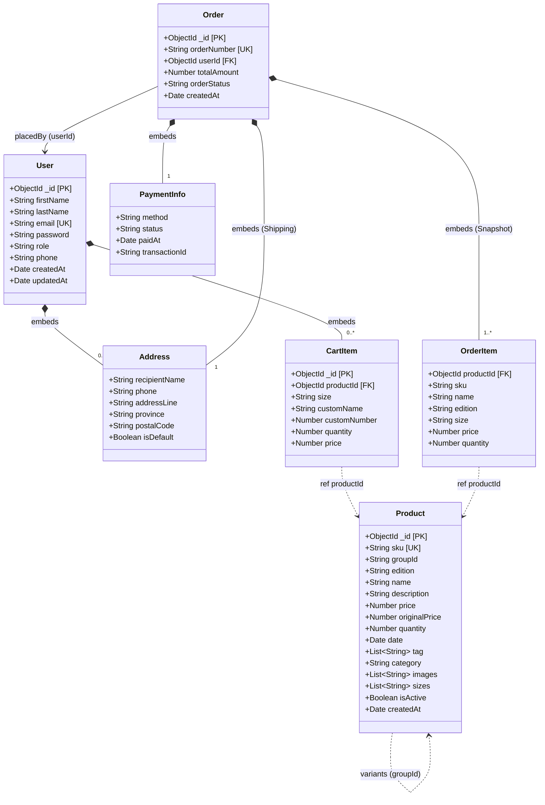

# 🗄️ Database Architecture & Schema Specification
**Project:** Zeta (ζ) - Football Jersey E-Commerce Store  
**Stack:** MERN Stack (MongoDB, Express, React, Node.js) with Mongoose ODM  
**Target:** JSD13 Group Project (Sprint 2 & Sprint 3 Rubric Compliant)

---

## 📌 1. ภาพรวมสถาปัตยกรรมฐานข้อมูล (Architecture Overview)

ระบบฐานข้อมูลออกแบบด้วยหลักการ **Hybrid Approach** ของ Document Database (MongoDB) โดยผสมผสานระหว่าง:
1. **Root Collections (4 ตารางหลัก):** `users`, `products`, `orders`, `reviews` สำหรับข้อมูลที่มีวงจรอิสระและมีโอกาสเติบโตต่อเนื่อง
2. **Embedded Subdocuments (ก้อนข้อมูลย่อย):** `cart_items`, `addresses`, `order_items`, `payment_info` เพื่อเพิ่ม Data Locality ลดการ Query ข้ามตาราง และทำให้การดึงข้อมูลหน้าเว็บรวดเร็ว

### จุดเด่นเชิงสถาปัตยกรรม (Architectural Highlights)
* **Product Family Pattern (`groupId`):** เสื้อแข่งรุ่น Player Edition และ Stadium Edition มีรหัสสต็อก (`sku`), ราคา (`price`), และสต็อก (`quantity`) แยกกันจริงในคลังสินค้า แต่ผูกโยงกันด้วย `groupId` เพื่อให้หน้าเว็บ Product Detail สลับรุ่นและเช็คสต็อกแต่ละรุ่นได้แบบ Real-time
* **Flexible Schema:** สินค้าทั่วไปที่ไม่มี Edition (เช่น หมวก, ผ้าพันคอ) สามารถใช้ Schema เดียวกันได้โดยปล่อย `groupId` และ `edition` เป็น `null`
* **Snapshot Pattern ใน Orders:** รายการสินค้าและราคาใน `order_items` จะถูกคัดลอก (Snapshot) ณ เวลาที่สั่งซื้อจริง เพื่อป้องกันราคาหรือชื่อสินค้าในประวัติคำสั่งซื้อเปลี่ยนแปลงหากแอดมินแก้ไขข้อมูลสินค้าในอนาคต
* **Rubric Compliance 100%:** รองรับฟิลด์บังคับตรวจของ Sprint 3 Task 10 ครบทั้ง 6 ฟิลด์ (`name`, `description`, `price`, `quantity`, `date`, `tag`)

---

## 📊 2. ผังความสัมพันธ์ (UML / ER Diagram)



---

## 📋 3. โครงสร้างข้อมูลอย่างละเอียด (Data Dictionary)

### 3.1 Collection: `products`
| Field Name | Data Type | Constraint | Description |
| :--- | :--- | :--- | :--- |
| `_id` | ObjectId | PK, Auto | รหัสประจำตัวสินค้า |
| `sku` | String | UK, Required | รหัสสต็อกสินค้า (e.g. `"LFC-2627-HM-PL"`) |
| `groupId` | String | Optional | รหัสกลุ่ม Variant เช่น `"LFC-2627-HOME"` (หมวกให้เป็น `null`) |
| `edition` | String | Optional | รุ่นของเสื้อ เช่น `"Player Edition"` (หมวกให้เป็น `null`) |
| `name` | String | Required | **[Rubric]** ชื่อสินค้า เช่น `"Liverpool FC 26/27 Home Jersey"` |
| `description` | String | Required | **[Rubric]** รายละเอียดเนื้อผ้าและสินค้า |
| `price` | Number | Required, Min 0 | **[Rubric]** ราคาขายจริงของรุ่นนี้ |
| `originalPrice`| Number | Optional | ราคาตั้งต้นก่อนลด (สำหรับคำนวณ % Discount) |
| `quantity` | Number | Required, Min 0 | **[Rubric]** จำนวนสต็อกคงเหลือของรุ่นนี้ |
| `date` | Date | Required | **[Rubric]** วันที่ลงสินค้า / วันเปิดตัว |
| `tag` | Array&lt;String&gt; | Required | **[Rubric]** แท็กหมวดหมู่ เช่น `["Liverpool", "Home", "26/27"]` |
| `category` | String | Optional | หมวดหมู่ลีก เช่น `"Premier League"` |
| `fit` | String | Optional | ทรงเสื้อ: `slim`, `regular`, `relaxed`, `oversized` |
| `kitType` | String | Optional | ประเภทชุด: `home`, `away`, `third`, `goalkeeper`, `training`, `lifestyle` |
| `activity` | String | Default: `football` | กิจกรรมที่เหมาะกับสินค้า |
| `images` | Array&lt;String&gt; | Required | ลิงก์รูปภาพ (Hero & Thumbnails) |
| `sizes` | Array&lt;String&gt; | Default | ไซส์ที่มีให้เลือก `["S", "M", "L", "XL", "2XL"]` |
| `isActive` | Boolean | Default: true | สถานะเปิด/ปิดการขาย (Soft Delete) |

---

### 3.2 Collection: `users`
| Field Name | Data Type | Constraint | Description |
| :--- | :--- | :--- | :--- |
| `_id` | ObjectId | PK, Auto | รหัสผู้ใช้งาน |
| `firstName` | String | Required | ชื่อ |
| `lastName` | String | Required | นามสกุล |
| `email` | String | UK, Required | อีเมลสำหรับ Login (ห้ามซ้ำ) |
| `password` | String | Required | รหัสผ่านที่เข้ารหัสด้วย bcrypt |
| `role` | String | Default: `'user'` | สิทธิ์การใช้งาน (`'user'` หรือ `'admin'`) |
| `phone` | String | Optional | เบอร์โทรศัพท์ |
| `addresses` | Array&lt;Subdoc&gt; | Embedded | รายการที่อยู่จัดส่งสินค้า |
| `cart` | Array&lt;Subdoc&gt; | Embedded | รายการสินค้าในตะกร้า |

#### ↳ Subdocument: `user.cart` (`cart_items`)
| Field Name | Data Type | Constraint | Description |
| :--- | :--- | :--- | :--- |
| `_id` | ObjectId | PK, Auto | รหัสประจำไอเทมในตะกร้า (ใช้ตอนสั่งลบ/แก้จำนวน) |
| `productId` | ObjectId | FK (Product) | รหัสสินค้าที่หยิบใส่ |
| `size` | String | Required | ไซส์ที่เลือก |
| `customName` | String | Optional | ชื่อสกรีนบนเสื้อ (e.g. `"SALAH"`) |
| `customNumber`| Number | Optional | เบอร์สกรีนบนเสื้อ (e.g. `11`) |
| `quantity` | Number | Required, Min 1 | จำนวนที่ต้องการสั่งซื้อ |
| `price` | Number | Required | ราคาต่อชิ้น ณ ตอนหยิบใส่ |

#### ↳ Subdocument: `user.addresses` (`addresses`)
| Field Name | Data Type | Constraint | Description |
| :--- | :--- | :--- | :--- |
| `recipientName`| String | Required | ชื่อผู้รับ |
| `phone` | String | Required | เบอร์โทรศัพท์ติดต่อ |
| `addressLine` | String | Required | รายละเอียดที่อยู่ |
| `province` | String | Required | จังหวัด |
| `postalCode` | String | Required | รหัสไปรษณีย์ |
| `isDefault` | Boolean | Default: false | ที่อยู่เริ่มต้น |

---

### 3.3 Collection: `orders`
| Field Name | Data Type | Constraint | Description |
| :--- | :--- | :--- | :--- |
| `_id` | ObjectId | PK, Auto | รหัสใบสั่งซื้อ |
| `orderNumber` | String | UK, Required | เลขที่คำสั่งซื้อ เช่น `"ZT-2026-0001"` |
| `userId` | ObjectId | FK (User) | รหัสผู้สั่งซื้อ |
| `items` | Array&lt;Subdoc&gt; | Embedded Snapshot | รายการสินค้าที่สั่งซื้อ (คัดลอกข้อมูล ณ วันซื้อ) |
| `shippingAddress`| Subdocument | Embedded Snapshot | ที่อยู่จัดส่งตอน Checkout |
| `payment` | Subdocument | Embedded | ข้อมูลการชำระเงินจำลอง (Simulated Payment) |
| `totalAmount` | Number | Required | ยอดเงินสุทธิรวมทั้งหมด |
| `orderStatus` | String | Default: `'pending'` | สถานะออร์เดอร์ (`'pending'`, `'processing'`, `'completed'`) |

### 3.4 Collection: `reviews`
| Field Name | Data Type | Constraint | Description |
| :--- | :--- | :--- | :--- |
| `_id` | ObjectId | PK, Auto | รหัสรีวิว |
| `productId` | ObjectId | FK, Required | สินค้าที่ถูกรีวิว |
| `userId` | ObjectId | FK, Required | ผู้เขียนรีวิว (หนึ่งคนต่อหนึ่งสินค้าได้หนึ่งรีวิว) |
| `orderId` | ObjectId | FK, Optional | ออร์เดอร์ที่ใช้ยืนยันการซื้อ |
| `rating` | Number | Required, 1–5 | คะแนนรวม |
| `detailedRatings` | Subdocument | Optional | คะแนน `comfort`, `quality`, `fit`, `length` (1–5) |
| `title` | String | Optional | หัวข้อรีวิว |
| `body` | String | Required | เนื้อหารีวิว |
| `tags` | Array&lt;String&gt; | Optional | คีย์เวิร์ดสำหรับ filter รีวิว |
| `isRecommended` | Boolean | Optional | ผู้ซื้อแนะนำสินค้าหรือไม่ |
| `verifiedPurchase` | Boolean | Default: false | สถานะยืนยันว่าเคยสั่งซื้อจริง |
| `helpfulCount` | Number | Default: 0 | จำนวนผู้กดว่ารีวิวมีประโยชน์ |
| `reportCount` | Number | Default: 0 | จำนวนการรายงานรีวิว |
| `status` | String | Default: `published` | สถานะ moderation: `pending`, `published`, `hidden` |

---

## 💻 4. โค้ด Mongoose Models (พร้อมนำไปใช้ใน Backend)

### 📄 `models/Product.js`
```javascript
import mongoose from 'mongoose';

const productSchema = new mongoose.Schema({
  sku:           { type: String, required: true, unique: true, trim: true },
  groupId:       { type: String, default: null, trim: true }, // e.g. "LFC-2627-HOME"
  edition:       { type: String, default: null },             // e.g. "Player Edition", "Stadium Edition"
  name:          { type: String, required: true, trim: true },
  description:   { type: String, required: true },
  price:         { type: Number, required: true, min: 0 },
  originalPrice: { type: Number, default: 0 },
  quantity:      { type: Number, required: true, min: 0 },
  date:          { type: Date, default: Date.now },
  tag:           [{ type: String, trim: true }],
  category:      { type: String, default: "Premier League" },
  images:        [{ type: String }],
  sizes:         { type: [String], default: ["S", "M", "L", "XL", "2XL"] },
  isActive:      { type: Boolean, default: true }
}, { timestamps: true });

export default mongoose.model('Product', productSchema);
```

---

### 📄 `models/User.js`
```javascript
import mongoose from 'mongoose';

const addressSchema = new mongoose.Schema({
  recipientName: { type: String, required: true },
  phone:         { type: String, required: true },
  addressLine:   { type: String, required: true },
  province:      { type: String, required: true },
  postalCode:    { type: String, required: true },
  isDefault:     { type: Boolean, default: false }
});

const cartItemSchema = new mongoose.Schema({
  productId:    { type: mongoose.Schema.Types.ObjectId, ref: 'Product', required: true },
  size:         { type: String, required: true },
  customName:   { type: String, default: "" },
  customNumber: { type: Number, default: null },
  quantity:     { type: Number, required: true, min: 1, default: 1 },
  price:        { type: Number, required: true }
});

const userSchema = new mongoose.Schema({
  firstName: { type: String, required: true, trim: true },
  lastName:  { type: String, required: true, trim: true },
  email:     { type: String, required: true, unique: true, lowercase: true, trim: true },
  password:  { type: String, required: true },
  role:      { type: String, enum: ['user', 'admin'], default: 'user' },
  phone:     { type: String, default: "" },
  addresses: [addressSchema],
  cart:      [cartItemSchema]
}, { timestamps: true });

export default mongoose.model('User', userSchema);
```

---

### 📄 `models/Order.js`
```javascript
import mongoose from 'mongoose';

const orderItemSchema = new mongoose.Schema({
  productId: { type: mongoose.Schema.Types.ObjectId, ref: 'Product', required: true },
  sku:       { type: String, required: true },
  name:      { type: String, required: true },
  edition:   { type: String, default: null },
  size:      { type: String, required: true },
  price:     { type: Number, required: true },
  quantity:  { type: Number, required: true }
});

const orderSchema = new mongoose.Schema({
  orderNumber: { type: String, required: true, unique: true },
  userId:      { type: mongoose.Schema.Types.ObjectId, ref: 'User', required: true },
  items:       [orderItemSchema],
  shippingAddress: {
    recipientName: String,
    phone:         String,
    addressLine:   String,
    province:      String,
    postalCode:    String
  },
  payment: {
    method:        { type: String, default: "PromptPay" },
    status:        { type: String, default: "completed" }, // Simulated
    paidAt:        { type: Date, default: Date.now },
    transactionId: { type: String, default: "" }
  },
  totalAmount: { type: Number, required: true },
  orderStatus: { 
    type: String, 
    enum: ['pending', 'processing', 'shipped', 'completed', 'cancelled'], 
    default: 'completed' 
  }
}, { timestamps: true });

export default mongoose.model('Order', orderSchema);
```

---

## ⚡ 5. ตัวอย่าง Query Patterns สำคัญ

### 5.1 ดึงสินค้าพร้อม Variant ใน Product Family เดียวกัน
```javascript
// GET /api/products/:id
router.get('/products/:id', async (req, res) => {
  const product = await Product.findById(req.params.id);
  if (!product) return res.status(404).json({ message: "Product not found" });

  let variants = [];
  if (product.groupId) {
    variants = await Product.find({ groupId: product.groupId })
                            .select('_id sku edition price quantity sizes');
  }

  res.json({ product, variants });
});
```

### 5.2 จัดการตะกร้าสินค้า (เพิ่มชิ้นเดิม = ทบจำนวน)
```javascript
// POST /api/users/:userId/cart
router.post('/users/:userId/cart', async (req, res) => {
  const { productId, size, customName, customNumber, quantity, price } = req.body;
  const user = await User.findById(req.params.userId);

  // ตรวจสอบว่าสินค้า + ไซส์เดิม มีอยู่ในตะกร้าแล้วหรือไม่
  const existingIndex = user.cart.findIndex(item => 
    item.productId.toString() === productId && 
    item.size === size
  );

  if (existingIndex > -1) {
    user.cart[existingIndex].quantity += (quantity || 1);
  } else {
    user.cart.push({ productId, size, customName, customNumber, quantity: (quantity || 1), price });
  }

  await user.save();
  res.json(user.cart);
});
```
